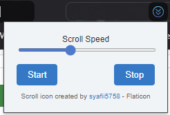

# Auto Scroller 
**Let the Auto Scroller do the work so you can focus on reading**

## Overview 
I created this browser extension to solve a common problem for readers of manhwas, mangas, or any long-form content: **the constant need to scroll**. Manually scrolling through long pages can be tiring, especially during longer reading sessions.

With this extension, you can set the scrolling to be automatic, adjusting the speed to match your reading pace so you can enjoy reading without interruptions.

## Features
- Adjustable Scrolling Speed: Customize the scroll speed from the extension's popup to suit your reading style.
- Start/Stop Controls: Start or stop scrolling with a click whenever you need to take a break.

## Motivation
As a frequent reader of manhwas and mangas, I was always getting pulled out of the story to keep scrolling. I built this extension to make the reading experience smoother by providing hands-free scrolling, perfect for anyone who wants to stay immersed in their story.

## Installation & Usage

1. Clone the repository or download the extension files.
2. Enable Developer Mode in your browser’s Extensions settings.
3. Load the unzipped extension folder, and you’re all set to use it!

For more details, check this guide on loading unpacked extensions: https://developer.chrome.com/docs/extensions/get-started/tutorial/hello-world#load-unpacked

## Attribution
Scroll Icon by <a href="https://www.flaticon.com/free-icons/dropdown-arrow" title="dropdown-arrow icons"> syafii5758</a> - Flaticon
